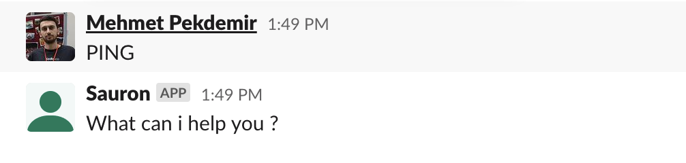
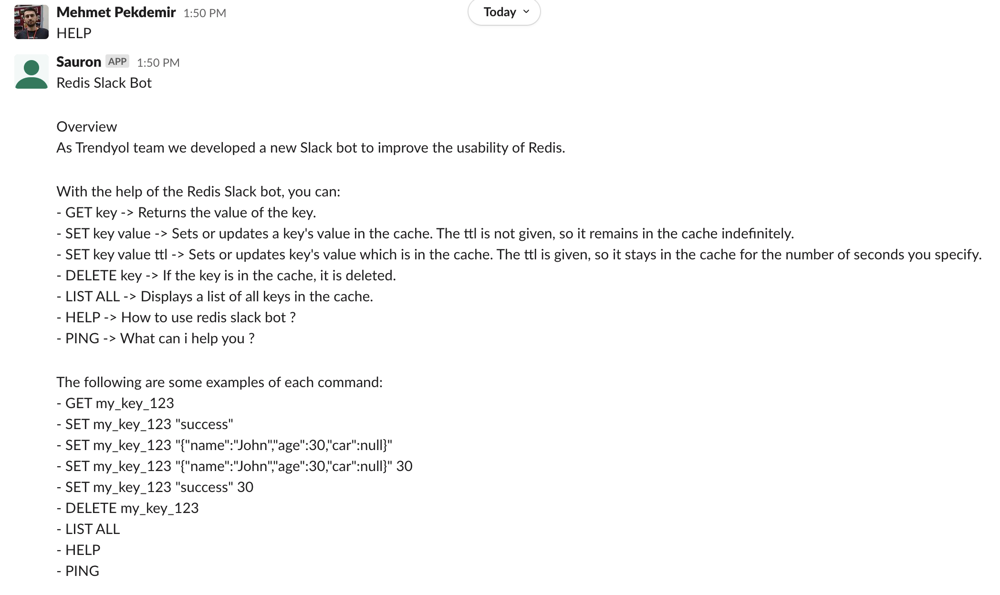
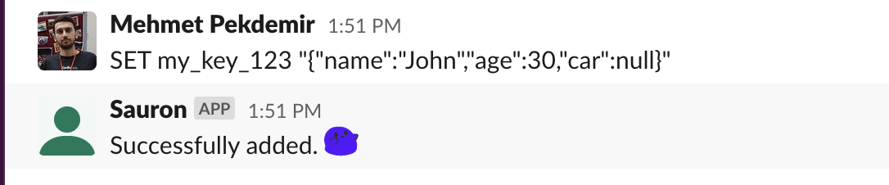
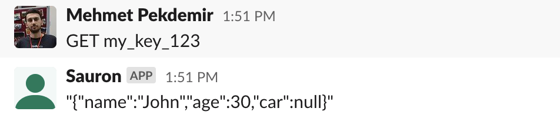
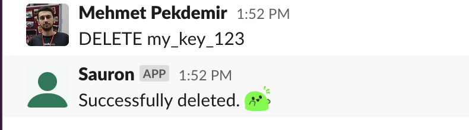
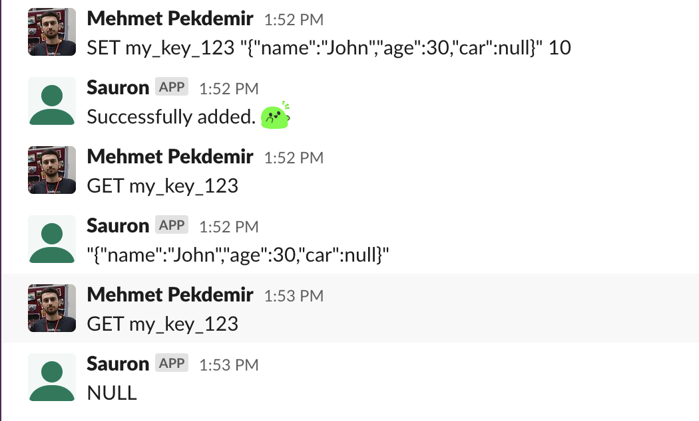
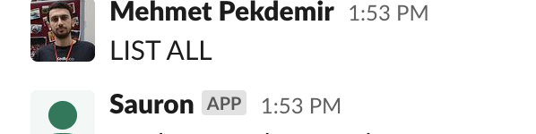

# Redis Slack Bot

## Overview 

* As Trendyol team we developed a new Slack bot to improve the usability of Redis. <br>


### With the help of the Redis Slack bot, you can:
```
- GET key -> Returns the value of the key.
- SET key value -> Sets or updates a key's value in the cache. The ttl is not given, so it remains in
  the cache indefinitely.
- SET key value ttl -> Sets or updates key's value which is in the cache. The ttl is given, so it stays
  in the cache for the number of seconds you specify.
- DELETE key -> If the key is in the cache, it is deleted.
- LIST ALL -> Displays a list of all keys in the cache.
- HELP -> How to use redis slack bot ?
- PING -> What can i help you ?
```
### The following are some examples of each command:
```
- GET my_key_123
- SET my_key_123 "success"
- SET my_key_123 "{"name":"John","age":30,"car":null}"
- SET my_key_123 "{"name":"John","age":30,"car":null}" 30
- SET my_key_123 "success" 30
- DELETE my_key_123
- LIST ALL
- HELP
- PING
```
### NOTE that!
- When performing the commands, the same syntax should be used as in the examples. There should be only one space between "COMMAND key value <strong>ttl</strong>".
  Otherwise, you will have entered an incorrect command.<br>
- Also, do not forget to check your key-value pair after setting data by using the get command!<br>


### Slack Bot Example:   
- PING <br>
   <br>
- HELP <br>
   <br>
- SET <br>
   <br>
- GET <br>
   <br>
- DELETE <br>
   <br>
- SET_TTL <br>
   <br>
- LIST_ALL <br>
   <br>

---

##### Tech Stack
- Java 17
- Spring Boot 3.0 & Spring 6.0
- Redis
- Slack Api Client

##### Requirements

For building and running the application, you need:
- [JDK 17](https://www.oracle.com/java/technologies/javase/jdk17-archive-downloads.html)
- [Maven](https://maven.apache.org)
- [Lombok](https://projectlombok.org/)
- [Slack](https://slack.dev/java-slack-sdk/guides/web-api-basics)
- [Redis](https://redis.io/)


##### Build & Run

Environment Variables
```
  SPRING_PROFILES_ACTIVE=prod
  REDIS_HOST = Your redis host
  REDIS_PASSWORD = Your redis password
  NOTIFY_TOKEN = Your slack bot token
  CHANNEL_ID = Your slack channel id 
```

```
  mvn clean install 
  mvn --projects redis-slack-bot spring-boot:run
```


##### Port
```
  http://localhost:9723
```

##### License

Distributed under the MIT License. See [LICENSE](LICENSE) for more information.